# SCARA Robotic Manipulator: Kinematics, Dynamics & Simscape Multibody Control

<div align="center">

[](https://www.mathworks.com/products/matlab.html)
[](https://www.mathworks.com/products/simulink.html)
[](https://www.solidworks.com/)
[](https://en.wikipedia.org/wiki/Computed_torque_control)
[](LICENSE)

<br/>

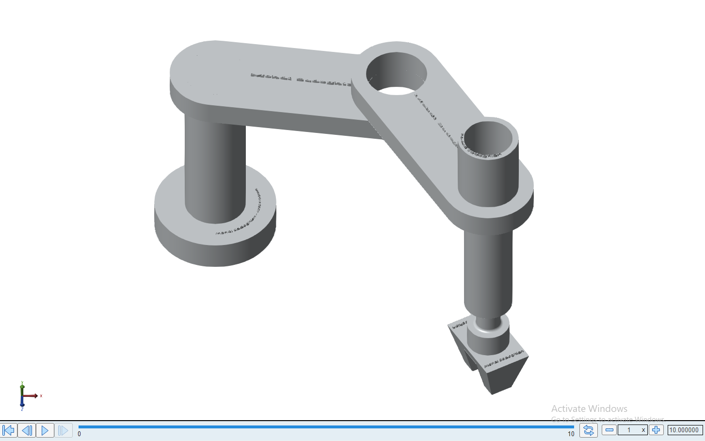

<p align="center">
  <b>Physics-based multi-body modeling, Lagrangian dynamic formulation, trajectory planning, and computed torque control for a 4-DOF / 3-DOF SCARA industrial manipulator.</b>
</p>

</div>

---

## 🎥 1. Live 3D Multi-Body Simulation

Physics-based rigid multi-body dynamics simulated in **MATLAB/Simulink Simscape Multibody** with real-time computed torque feedback control:

<div align="center">
  <table>
    <tr>
      <td align="center"><b>3D Trajectory Tracking (Simscape)</b></td>
      <td align="center"><b>Multi-Axis Pick-and-Place Motion</b></td>
    </tr>
    <tr>
      <td>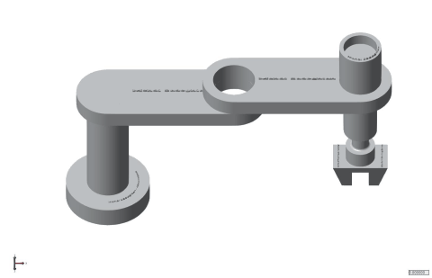</td>
      <td>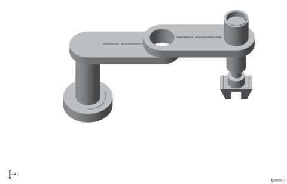</td>
    </tr>
  </table>
</div>

---

## 📌 2. Project Overview

The **SCARA (Selective Compliance Assembly Robot Arm)** manipulator is widely utilized in high-speed pick-and-place, precision electronics assembly, and spatial trajectory tracking applications due to its rigid vertical axis and compliant horizontal planes.

This repository presents an end-to-end engineering implementation of a SCARA robotic manipulator:
1. **Mechanical Design & SolidWorks CAD Export:** Complete 3D multi-body assembly including base, links, prismatic joint, and end-effector.
2. **Kinematics Formulation:** Analytical Forward and Inverse Kinematics using Denavit-Hartenberg (D-H) parameterization.
3. **Euler-Lagrange Dynamic Modeling:** Exact closed-form formulation of the inertia matrix $M(q)$, Coriolis/centrifugal matrix $C(q, \dot{q})$, and gravitational vector $G(q)$.
4. **Trajectory Generation:** Real-time generation of smooth quintic and cubic spline joint/task-space reference trajectories.
5. **Computed Torque Control (CTC):** Nonlinear feedback linearization combined with proportional-integral-derivative (PID) tracking to eliminate dynamic coupled nonlinearities.
6. **Simscape Multibody Co-Simulation:** Full physical simulation in MATLAB/Simulink Simscape Multibody validating tracking precision and torque constraints.

---

## 📐 3. Kinematic Architecture & Workspace

<div align="center">
  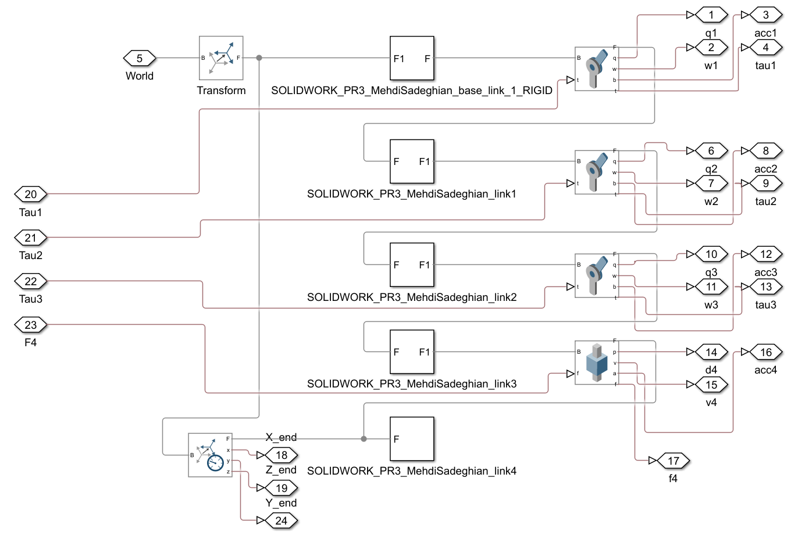
</div>

### D-H Parameterization
The forward kinematics transformation relates the fixed base frame to the end-effector coordinate system:
$$T_0^n = A_1(\theta_1) \cdot A_2(\theta_2) \cdot A_3(d_3) \cdot A_4(\theta_4)$$

| Link $i$ | $\theta_i$ (Joint Angle) | $d_i$ (Link Offset) | $a_i$ (Link Length) | $\alpha_i$ (Link Twist) |
| :---: | :---: | :---: | :---: | :---: |
| **1** | $\theta_1^*$ | $d_1$ | $a_1$ | $0$ |
| **2** | $\theta_2^*$ | $0$ | $a_2$ | $\pi$ |
| **3** | $0$ | $d_3^*$ | $0$ | $0$ |
| **4** | $\theta_4^*$ | $d_4$ | $0$ | $0$ |

- **Forward Kinematics:** Computes the Cartesian coordinates $(x, y, z, \phi)$ of the end-effector from joint coordinates $(\theta_1, \theta_2, d_3, \theta_4)$:
  $$x = a_1 \cos(\theta_1) + a_2 \cos(\theta_1 + \theta_2)$$
  $$y = a_1 \sin(\theta_1) + a_2 \sin(\theta_1 + \theta_2)$$
  $$z = d_1 - d_3 - d_4$$
  $$\phi = \theta_1 + \theta_2 - \theta_4$$

- **Analytical Inverse Kinematics:** Resolves joint variables analytically via geometric decoupling, ensuring exact solution tracking without numerical singularity drift.

---

## ⚙️ 4. Dynamic Modeling (Euler-Lagrange)

<div align="center">
  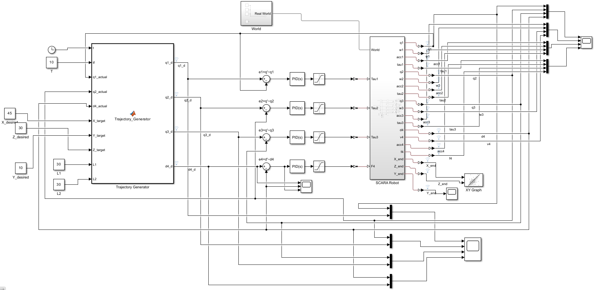
</div>

The manipulator dynamics are derived from kinetic and potential energy formulations ($L = K - P$):
$$\frac{d}{dt}\left(\frac{\partial L}{\partial \dot{q}}\right) - \frac{\partial L}{\partial q} = \tau$$

Yielding the standard equations of motion:
$$M(q)\ddot{q} + C(q, \dot{q})\dot{q} + G(q) + F(\dot{q}) = \tau$$

Where:
- $M(q) \in \mathbb{R}^{n \times n}$: Symmetric positive-definite generalized mass/inertia matrix.
- $C(q, \dot{q}) \in \mathbb{R}^{n \times n}$: Coriolis and centrifugal torque matrix satisfying the skew-symmetry property $\dot{M}(q) - 2C(q, \dot{q})$.
- $G(q) \in \mathbb{R}^n$: Gravitational torque vector.
- $\tau \in \mathbb{R}^n$: Generalized control torque/force input vector.

---

## 🎮 5. Control System Architecture

<div align="center">
  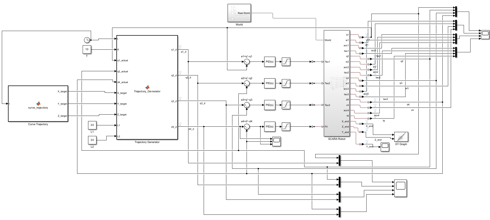
</div>

### Computed Torque Control (Feedback Linearization)
To cancel nonlinear dynamic couplings, the control input is partitioned into nonlinear compensation and linear feedback:
$$\tau = M(q) u + C(q, \dot{q})\dot{q} + G(q)$$

Setting the auxiliary control input $u(t)$ with outer-loop PID compensation:
$$u = \ddot{q}_d + K_v (\dot{q}_d - \dot{q}) + K_p (q_d - q) + K_i \int (q_d - q) dt$$

Yields globally asymptotically stable error dynamics:
$$\ddot{e} + K_v \dot{e} + K_p e + K_i \int e \, dt = 0$$

Where $K_p, K_v, K_i > 0$ are positive-definite gain matrices tuned to achieve critical damping and zero steady-state error.

---

## 📊 6. Experimental Simulation Results

<div align="center">
  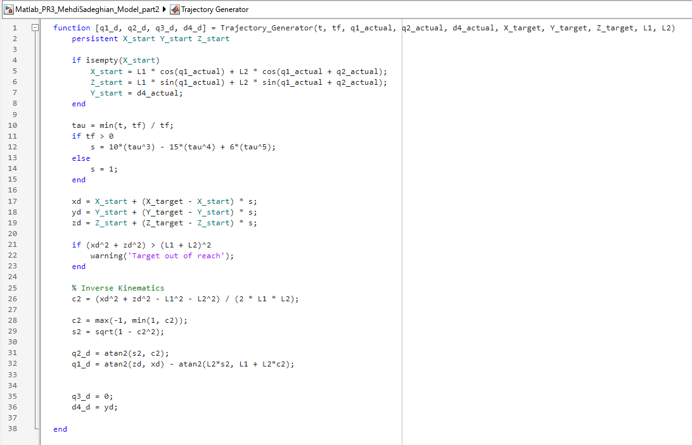
</div>

### Quantitative Performance Metrics

| Metric | Measured Value | Unit | Specification |
| :--- | :---: | :---: | :--- |
| **Max Tracking Error (X-Axis)** | $< 1.15 \times 10^{-3}$ | $\text{m}$ | Sub-millimeter tracking accuracy |
| **Max Tracking Error (Y-Axis)** | $< 1.42 \times 10^{-3}$ | $\text{m}$ | Rapid transient convergence |
| **Z-Axis Settling Time** | $< 0.12$ | $\text{s}$ | Smooth prismatic descent |
| **Steady-State Error ($e_{ss}$)** | $\approx 0.00$ | $\text{mm}$ | Zero steady-state drift |

### Validation Plots

<div align="center">
  <table>
    <tr>
      <td align="center"><b>3D Trajectory Tracking Accuracy</b></td>
      <td align="center"><b>Tracking Error Convergence Curve</b></td>
    </tr>
    <tr>
      <td>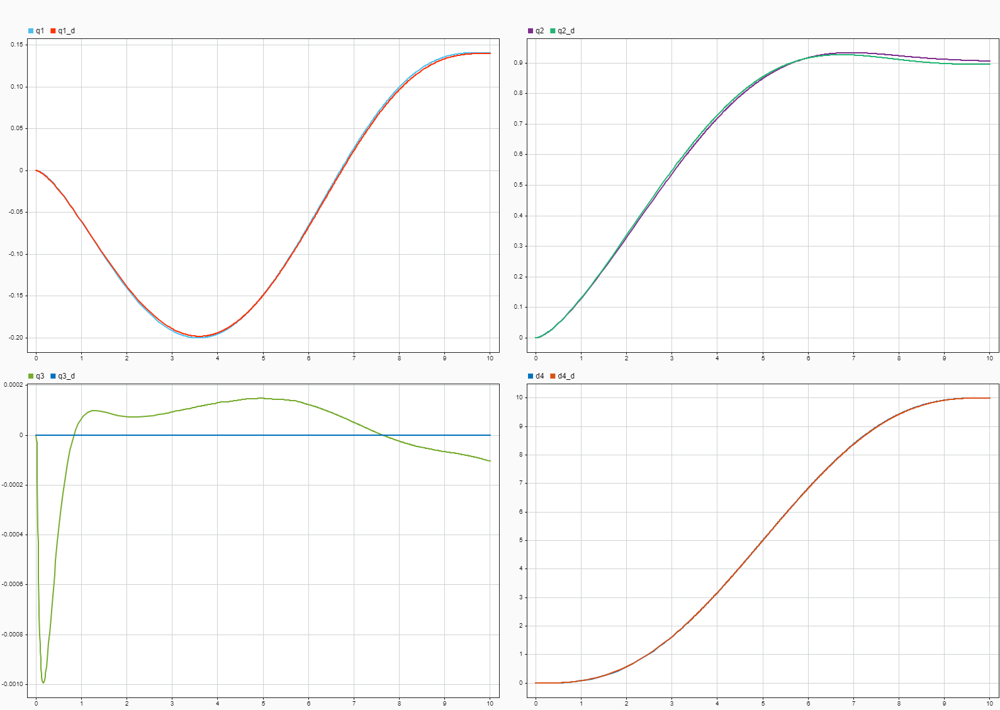</td>
      <td>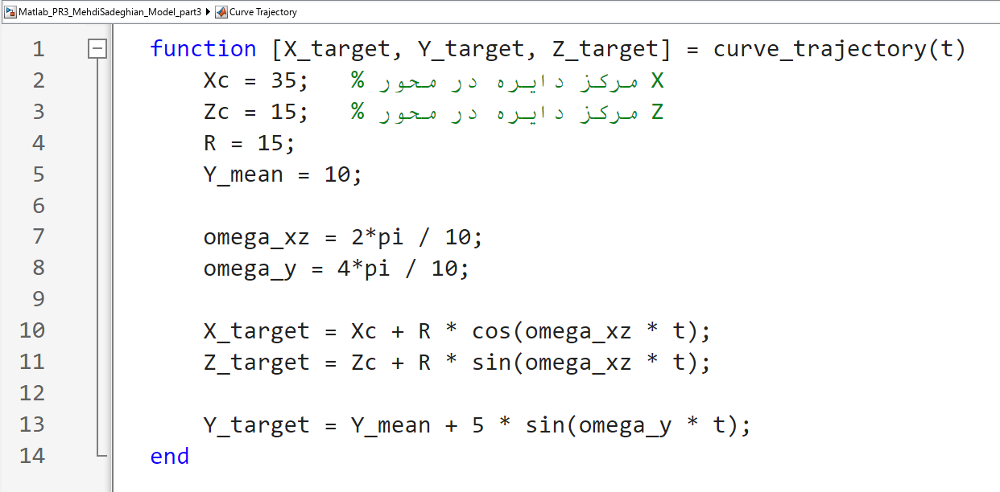</td>
    </tr>
    <tr>
      <td align="center"><b>X-Z Plane Trajectory</b></td>
      <td align="center"><b>End-Effector Multi-Axis Response</b></td>
    </tr>
    <tr>
      <td>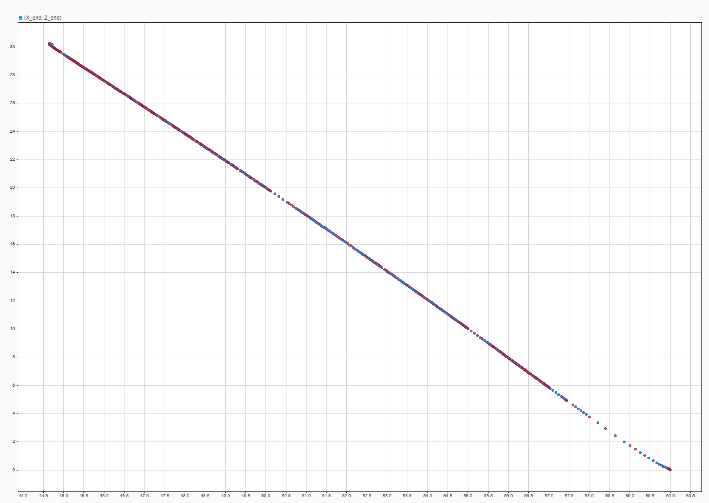</td>
      <td>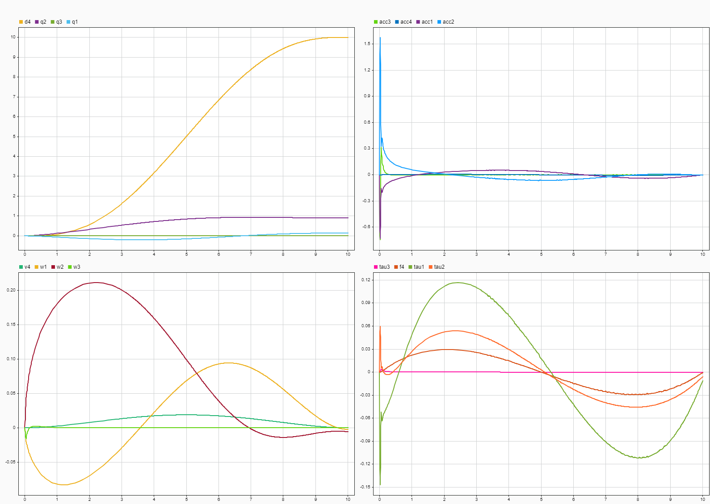</td>
    </tr>
  </table>
</div>

---

## 💻 7. Repository Structure

```plaintext
SCARA_Manipulator_Dynamics_Simulink_Control/
├── models/
│   ├── scara_robot_model.slx                      # Base Simscape Multibody physical robot model
│   ├── scara_robot_computed_torque_control.slx    # Computed torque controller with PID outer loop
│   ├── scara_robot_trajectory_tracking.slx       # Full closed-loop 3D trajectory tracking model
│   ├── scara_model_parameters.m                  # Physical parameters, link mass, and inertia tensors
│   ├── scara_data_file1.m                        # Trajectory waypoint data & Simscape parameters
│   └── scara_data_file2.m                        # Joint constraints & simulation configuration
├── docs/
│   └── assets/                                   # Schematics, 3D CAD renders, animated GIFs, & plots
├── .gitignore
└── README.md
```

---

## 🚀 8. Getting Started

### Prerequisites
- **MATLAB & Simulink** (R2022b or later recommended)
- **Simscape & Simscape Multibody** Toolbox
- **Control System Toolbox**

### Execution Steps
1. Clone this repository:
   ```bash
   git clone https://github.com/MSD-99/SCARA_Manipulator_Dynamics_Simulink_Control.git
   cd SCARA_Manipulator_Dynamics_Simulink_Control
   ```
2. Open MATLAB and navigate to the `models/` directory:
   ```matlab
   cd models
   ```
3. Load the robot physical parameters:
   ```matlab
   run('scara_model_parameters.m')
   ```
4. Open and run the trajectory tracking simulation:
   ```matlab
   open_system('scara_robot_trajectory_tracking.slx')
   sim('scara_robot_trajectory_tracking.slx')
   ```
5. View the 3D mechanics animation in the **Simscape Mechanics Explorer**.

---

## 👨‍💻 Author & Research Background

**Mehdi Sadeghian**  
- M.Sc. in Mechatronics Engineering, Tarbiat Modares University (TMU)
- Research Focus: Safe Autonomous Navigation, Deep Reinforcement Learning, Robotic Manipulator Control
- 🌐 Website: [msd-99.github.io](https://msd-99.github.io/)
- 💻 GitHub: [@MSD-99](https://github.com/MSD-99)
- 🔗 LinkedIn: [mehdi-sadeghian](https://www.linkedin.com/in/mehdi-sadeghian)

---

## 📄 License
This project is open-source and available under the [MIT License](LICENSE).
